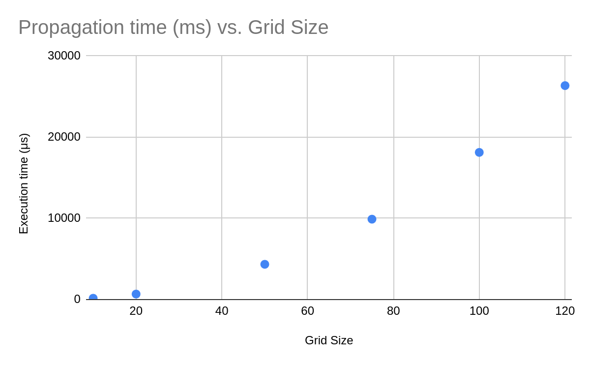
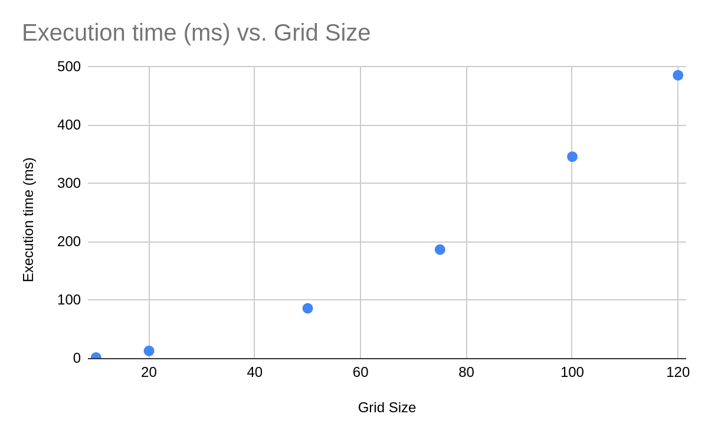
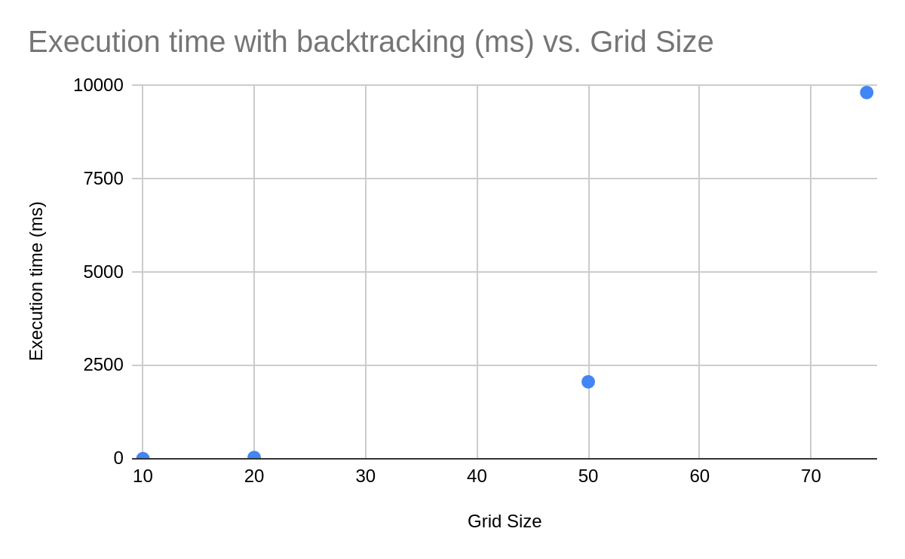

# Implementation Document

## Architecture

`src/wave_function_collapse` implementation of the main algorithm - which is quite short as it has been abstracted quite a bit

`src/tile_extraction` implementation of "tile extraction", the process of turning an input image into tiles that can be combined according to some `RuleSet`

`src/tile`, `src/grid` data structures for storing the current grid state

`src/rules` data structure for storing and checking generated rules between tiles

`src/utils` helper data structures for positions, directions and "entropy calculations"

`src/wasm` bindings to web assembly (everything here can be called from javascript)

`frontend` Web UI

## Time complexity

Practical testing suggests that the base algorithm (without backtracking) has been implemented with **quadratic** average time complexity.

All benchmarks were run on a Framework Laptop 13 with a AMD Ryzen 7040 processor - plugged in, using Linux 6.12.26 with a performance cpu governor.

### Propagation

A basic tile pattern ruleset was used. 100 samples were taken for each grid size. Presented times are the mean of those 100 samples.

### Full execution without backtracking

A failure prone "flower" tileset was used. 100 samples were taken for each grid size. Presented times are the mean of those 100 samples.

### Full execution with backtracking

A failure prone "flower" tileset was used. 100 samples were taken for each grid size. Presented times are the mean of those 100 samples.
Only a limited number of grid sizes were tested as the execution time blew up.

## Usage of Large Language Models

I used a local version of qwq (32b) to get some quick feedback on some of my ideas on testing and UI hacking.

## Sources

### 1

Maxim Gumin, Wave Function Collapse implementation. Retrieved from https://github.com/mxgmn/WaveFunctionCollapse

### 2

I. Karth and A. M. Smith, "WaveFunctionCollapse: Content Generation via Constraint Solving and Machine Learning" in IEEE Transactions on Games, vol. 14, no. 3, pp. 364-376, Sept. 2022, doi: 10.1109/TG.2021.3076368. Available: https://ieeexplore.ieee.org/document/9421370
